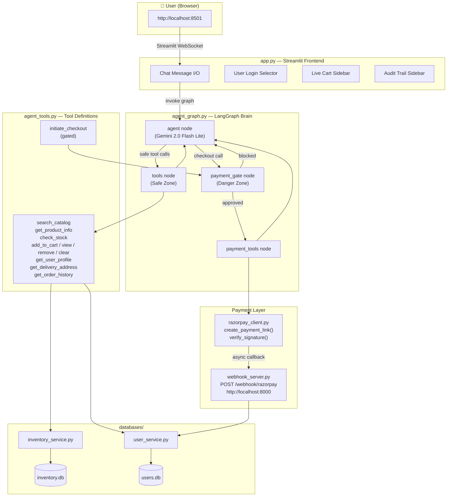
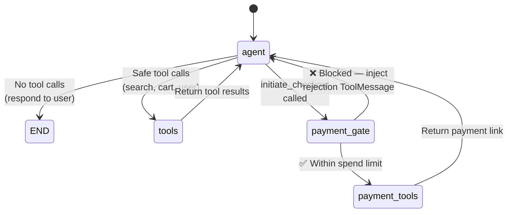

# 🛒 Implementation Plan — Conversational In-App Checkout

> **Generated:** 2026-08-29  
> **Status:** Data Layer ✅ Done | Agent Layer ⬜ Todo | Payment Layer ⬜ Todo | Frontend ⬜ Todo

---

## Table of Contents

1. [Current State Assessment](#1-current-state-assessment)
2. [System Architecture](#2-system-architecture)
3. [LangGraph State Machine](#3-langgraph-state-machine)
4. [Component Inventory](#4-component-inventory)
5. [Phase-by-Phase Plan](#5-phase-by-phase-plan)
   - [Phase 1 — Agent Tools](#phase-1--agent-tools-agent_toolspy)
   - [Phase 2 — Razorpay Client](#phase-2--razorpay-payment-client-razorpay_clientpy)
   - [Phase 3 — LangGraph Brain](#phase-3--langgraph-agent-brain-agent_graphpy)
   - [Phase 4 — Streamlit Frontend](#phase-4--streamlit-chat-frontend-apppy)
   - [Phase 5 — Webhook Server](#phase-5--webhook-server-webhook_serverpy)
6. [End-to-End Test Scenarios](#6-end-to-end-test-scenarios)
7. [Environment & Startup](#7-environment--startup-checklist)

---

## 1. Current State Assessment

### ✅ Completed (Ready to use)

| File | Description |
|------|-------------|
| `databases/inventory.db` | 479 KB product catalog with FTS5 full-text search |
| `databases/inventory_service.py` | Product search, variant lookup, stock check, full cart CRUD |
| `databases/user_service.py` | User profiles, addresses, spend-limit verification, order lifecycle, audit logging |
| `databases/users.db` | Seeded users with addresses, mandates, and order history |
| `databases/seed_users.py` | 5 diverse mock users with varying spend limits |
| `databases/seed_orders.py` | Realistic past order history from real inventory |
| `pyproject.toml` | All dependencies declared (LangGraph, Streamlit, Razorpay, FastAPI, etc.) |

### ⬜ Empty (Must be built)

| File | Role |
|------|------|
| `chat_agent/agent_tools.py` | LangChain `@tool` wrappers for the LLM |
| `chat_agent/razorpay_client.py` | Razorpay test payment link generator |
| `chat_agent/agent_graph.py` | LangGraph state machine — the "Brain" |
| `chat_agent/app.py` | Streamlit conversational UI — the "Frontend" |
| `chat_agent/webhook_server.py` | FastAPI server for Razorpay webhooks |

---

## 2. System Architecture



---

## 3. LangGraph State Machine

This is the exact node/edge topology to implement in `agent_graph.py`:



### State Schema

```python
class AgentState(TypedDict):
    messages:        Annotated[list, add_messages]   # conversation history
    user_id:         int                             # logged-in user
    session_id:      str                             # cart session key
    payment_status:  str                             # "none" | "link_sent" | "paid" | "failed"
```

### Routing Logic

| Function | Condition | Routes To |
|----------|-----------|-----------|
| `should_continue()` | No tool calls in last message | `END` |
| | `initiate_checkout` in tool calls | `payment_gate` |
| | Any other tool calls | `tools` |
| `gate_decision()` | `verify_agent_spend_permission()` → allowed | `payment_tools` |
| | `verify_agent_spend_permission()` → blocked | `agent` (with rejection message) |

---

## 4. Component Inventory

| File | Role | Key Functions |
|------|------|---------------|
| `agent_tools.py` | The Hands | 11 `@tool`-decorated functions wrapping service calls |
| `razorpay_client.py` | Payment SDK | `create_payment_link()`, `verify_webhook_signature()` |
| `agent_graph.py` | The Brain | `AgentState`, `build_graph()`, 4 nodes, conditional edges |
| `app.py` | The Frontend | Streamlit chat UI, user selector, cart panel, audit panel |
| `webhook_server.py` | Async Listener | FastAPI: `POST /webhook/razorpay`, signature verify, order update |
| `inventory_service.py` | Data (Products) | `search_products`, `cart_add/get/remove/clear`, `check_stock` |
| `user_service.py` | Data (Users) | `verify_agent_spend_permission`, `create_order_from_cart`, `log_agent_audit` |

---

## 5. Phase-by-Phase Plan

---

### Phase 1 — Agent Tools (`agent_tools.py`)

> **Effort:** ~1 hour · **Depends on:** `databases/` (already done)

Wrap every database service function as a LangChain `@tool` so the LLM can call them.

#### Tools to Define

| # | Tool Name | Wraps | Description |
|---|-----------|-------|-------------|
| 1 | `search_catalog` | `inventory_service.search_products()` | Search by keyword, category, price, color, size |
| 2 | `get_product_info` | `inventory_service.get_product_details()` | Full product detail by ID or SKU |
| 3 | `check_stock_availability` | `inventory_service.check_stock()` | Check variant stock level |
| 4 | `add_to_cart` | `inventory_service.cart_add()` | Add variant to session cart |
| 5 | `view_cart` | `inventory_service.cart_get()` | Full cart breakdown with totals |
| 6 | `remove_from_cart` | `inventory_service.cart_remove()` | Remove item by cart_item_id |
| 7 | `clear_cart` | `inventory_service.cart_clear()` | Wipe entire cart |
| 8 | `get_user_profile` | `user_service.get_user_by_id()` | User details + spend limits |
| 9 | `get_delivery_address` | `user_service.get_user_default_address()` | Default shipping address |
| 10 | `get_order_history` | Query `orders` table | Past orders for context |
| 11 | `initiate_checkout` | **⚠️ GATED** — intercepted by `payment_gate` | Signals checkout intent |

#### Implementation Notes

- Import: `from langchain_core.tools import tool`
- Each tool returns a JSON string via `json.dumps()`
- **Every tool execution must log** to `agent_audit_logs` via `log_agent_audit()`
- Test each tool in a `__main__` block

---

### Phase 2 — Razorpay Payment Client (`razorpay_client.py`)

> **Effort:** ~30 min · **Depends on:** `.env` (credentials already present)

#### Functions to Implement

| Function | Purpose |
|----------|---------|
| `init_razorpay_client()` | Load keys from `.env`, return `razorpay.Client` |
| `create_payment_link(amount_inr, description, customer_name, customer_email, customer_phone, order_number, callback_url)` | Create Razorpay test payment link (amount in paise) |
| `verify_webhook_signature(payload_body, signature, secret)` | Verify Razorpay webhook signature |

#### Key Details

```python
# Amount conversion
amount_paise = int(amount_inr * 100)

# Payment link payload
{
    "amount": amount_paise,
    "currency": "INR",
    "description": description,
    "customer": {"name": ..., "email": ..., "contact": ...},
    "notify": {"sms": True, "email": True},
    "callback_url": "http://localhost:8000/webhook/razorpay",
    "callback_method": "get",
    "notes": {"order_number": order_number}
}
```

#### Test Credentials (already in `.env`)

```
RAZORPAY_KEY_ID=rzp_test_TVIBzvuHw71rM3
RAZORPAY_KEY_SECRET=o4v0Z9KI56sOz2CLR6QpLX1Q
```

---

### Phase 3 — LangGraph Agent Brain (`agent_graph.py`)

> **Effort:** ~2 hours · **Depends on:** Phase 1 + Phase 2  
> ⚠️ **This is the core phase — the most critical file.**

#### Step 3.1 — State Schema

```python
from typing import TypedDict, Annotated
from langgraph.graph.message import add_messages

class AgentState(TypedDict):
    messages:        Annotated[list, add_messages]
    user_id:         int
    session_id:      str
    payment_status:  str  # "none" | "link_sent" | "paid" | "failed"
```

#### Step 3.2 — System Prompt

The LLM must be instructed to:
- Greet the user by name (via `get_user_profile`)
- Search products, build carts, answer questions conversationally
- **NEVER** fabricate product info — always use `search_catalog` first
- Call `initiate_checkout` only after confirming cart with user
- Handle errors gracefully (OOS, payment failed, spend limit exceeded)

#### Step 3.3 — Node Definitions

| Node | Zone | Responsibility |
|------|------|----------------|
| `agent` | — | Calls LLM (Gemini 2.0 Flash Lite) with all bound tools |
| `tools` | 🟢 Safe Zone | Executes safe tools (search, cart, user info) via `ToolNode` |
| `payment_gate` | 🔴 Danger Zone | Intercepts `initiate_checkout`, verifies spend limit, logs audit |
| `payment_tools` | 🔴 Danger Zone | Creates order, generates Razorpay link, binds to order |

#### Step 3.4 — Payment Gate Logic (Trust & Safety Critical)

```python
def payment_gate_node(state):
    # 1. Get cart total
    cart = inventory_service.cart_get(state["session_id"])
    total = cart["grand_total"]

    # 2. Verify against user's spend limit
    check = user_service.verify_agent_spend_permission(state["user_id"], total)

    # 3. Log to audit trail (is_gated=True)
    user_service.log_agent_audit(
        session_id=state["session_id"],
        action_type="PAYMENT_GATE_CHECK",
        reasoning=check["reason"],
        payload={"cart_total": total, "allowed": check["allowed"]},
        user_id=state["user_id"],
        is_gated=True,
        user_confirmed=check["allowed"]
    )

    # 4. Route decision
    if check["allowed"]:
        # → payment_tools
    else:
        # Inject rejection ToolMessage → agent
```

#### Step 3.5 — Graph Assembly

```python
graph = StateGraph(AgentState)

graph.add_node("agent", agent_node)
graph.add_node("tools", tool_node)
graph.add_node("payment_gate", payment_gate_node)
graph.add_node("payment_tools", payment_tools_node)

graph.set_entry_point("agent")

graph.add_conditional_edges("agent", should_continue, {
    END: END,
    "tools": "tools",
    "payment_gate": "payment_gate"
})
graph.add_edge("tools", "agent")
graph.add_conditional_edges("payment_gate", gate_decision, {
    "agent": "agent",
    "payment_tools": "payment_tools"
})
graph.add_edge("payment_tools", "agent")

memory = SqliteSaver.from_conn_string(":memory:")
compiled = graph.compile(checkpointer=memory)
```

---

### Phase 4 — Streamlit Chat Frontend (`app.py`)

> **Effort:** ~1.5 hours · **Depends on:** Phase 3

#### Layout Structure

```
┌─────────────────────────────────────────────────────────────┐
│  SIDEBAR                    │          MAIN AREA            │
│  ┌───────────────────────┐  │                               │
│  │ 👤 User Selector      │  │   🤖 AI: "Hi Ankush! ..."    │
│  │    [Dropdown]         │  │                               │
│  │    Name / Email       │  │   👤 You: "Show me whey..."   │
│  │    Limit: ₹4,000     │  │                               │
│  ├───────────────────────┤  │   🤖 AI: "Here are 3..."     │
│  │ 🛒 Cart (3 items)    │  │                               │
│  │    Whey Protein ₹1.8k│  │   👤 You: "Add the first"    │
│  │    Running Shoes ₹2.1k│  │                               │
│  │    ──────────────     │  │   🤖 AI: "Added! Cart..."    │
│  │    Total: ₹4,212     │  │                               │
│  ├───────────────────────┤  │   💳 [Pay Now ₹4,212]        │
│  │ 🔍 Audit Trail       │  │                               │
│  │   12:01 SEARCH        │  │   ┌──────────────────────┐   │
│  │   12:02 CART_ADD      │  │   │  Type a message...   │   │
│  │   12:03 GATE_CHECK ✅ │  │   └──────────────────────┘   │
│  └───────────────────────┘  │                               │
└─────────────────────────────────────────────────────────────┘
```

#### Key Implementation Steps

1. **Page config:** `st.set_page_config(page_title="🛒 AI Checkout Assistant", layout="wide")`
2. **Sidebar — User selector:** `st.selectbox()` querying all users from `users.db`
3. **Sidebar — Live cart:** Refresh on every rerun via `cart_get(session_id)`
4. **Sidebar — Audit trail:** `st.expander("🔍 Agent Audit Trail")` via `get_session_audit_trail()`
5. **Chat area:** `st.chat_message()` loop + `st.chat_input()` for user messages
6. **Payment link:** Detect Razorpay URLs → render as `st.link_button("💳 Complete Payment", url)`
7. **Graph caching:** `@st.cache_resource` for the compiled graph (build once)

#### Startup

```bash
streamlit run chat_agent/app.py
```

---

### Phase 5 — Webhook Server (`webhook_server.py`)

> **Effort:** ~45 min · **Depends on:** Phase 2 + Phase 3

#### Endpoints

| Method | Path | Purpose |
|--------|------|---------|
| `POST` | `/webhook/razorpay` | Receive Razorpay payment callbacks |
| `GET` | `/webhook/status/{order_id}` | Poll payment status (for frontend) |
| `GET` | `/health` | Readiness check |

#### Webhook Handler Logic

```python
@app.post("/webhook/razorpay")
async def handle_webhook(request: Request):
    body = await request.body()
    signature = request.headers.get("X-Razorpay-Signature")

    # 1. Verify signature
    if not verify_webhook_signature(body, signature, secret):
        raise HTTPException(400, "Invalid signature")

    payload = await request.json()
    event = payload.get("event")

    if event == "payment_link.paid":
        # → finalize_order_payment() → cart_clear() → audit log
    elif event in ("payment_link.expired", "payment_link.cancelled"):
        # → update order to "failed" → audit log

    return {"status": "ok"}
```

#### Startup

```bash
uvicorn chat_agent.webhook_server:app --host 0.0.0.0 --port 8000
```

> **Note:** For localhost demos, use **ngrok** (`ngrok http 8000`) to expose the webhook endpoint to Razorpay, or poll Razorpay's API directly.

---

## 6. End-to-End Test Scenarios

### Scenario 1 — ✅ Happy Path (Within Spend Limit)

| Step | User Says | Agent Does | Gate |
|------|-----------|-----------|------|
| 1 | *(logs in)* | Greets by name | — |
| 2 | "Show me whey protein under ₹2000" | `search_catalog` → presents results | — |
| 3 | "Add the Nakpro one in chocolate" | `add_to_cart` → confirms | — |
| 4 | "What's in my cart?" | `view_cart` → shows summary | — |
| 5 | "Checkout" | `initiate_checkout` | ✅ ₹1,800 < ₹4,000 |
| 6 | *(clicks link, pays)* | Webhook → "Payment confirmed!" | — |

> **Expected audit entries:** 6+ (search, add, view, gate_check, payment_link, payment_confirmed)

### Scenario 2 — ❌ Spend Limit Exceeded

| Step | User Says | Agent Does | Gate |
|------|-----------|-----------|------|
| 1 | *(adds items totalling ₹2,500)* | `add_to_cart` | — |
| 2 | "Let's checkout" | `initiate_checkout` | ❌ ₹2,500 > ₹1,500 |
| 3 | — | "This exceeds your ₹1,500 limit. Remove items or contact support." | — |

### Scenario 3 — 🚫 Out of Stock

| Step | User Says | Agent Does |
|------|-----------|-----------|
| 1 | "Add the blue variant" | `add_to_cart` → "Insufficient stock" |
| 2 | — | "That's out of stock. Want me to find alternatives?" |

### Scenario 4 — 🔄 Cart Modification

| Step | User Says | Agent Does |
|------|-----------|-----------|
| 1 | "Add Nike shoes black size 10" | `add_to_cart` |
| 2 | "Remove those, add Adidas instead" | `remove_from_cart` → `add_to_cart` |
| 3 | "Clear my whole cart" | `clear_cart` |

### Scenario 5 — 💳 Payment Failure

| Step | What Happens | Agent Does |
|------|-------------|-----------|
| 1 | Payment link generated | "Here's your payment link" |
| 2 | Card declined / link expired | Webhook → failure event |
| 3 | — | "Payment didn't go through. Want a new link?" |

---

## 7. Environment & Startup Checklist

### Prerequisites

- [ ] Python 3.11+
- [ ] `uv` or `pip` available
- [ ] Razorpay Test Mode account active
- [ ] Google AI API key for Gemini

### Environment Variables (`chat_agent/.env`)

```env
RAZORPAY_KEY_ID=rzp_test_TVIBzvuHw71rM3
RAZORPAY_KEY_SECRET=o4v0Z9KI56sOz2CLR6QpLX1Q
GOOGLE_API_KEY=<your-gemini-api-key>
RAZORPAY_WEBHOOK_SECRET=<from-razorpay-dashboard>
```

### Database Initialization

```bash
python databases/user_service.py
python databases/seed_users.py
python databases/seed_orders.py
```

### Startup Order

| Terminal | Command | Port |
|----------|---------|------|
| 1 | `uvicorn chat_agent.webhook_server:app --host 0.0.0.0 --port 8000` | 8000 |
| 2 | `ngrok http 8000` *(optional, for webhooks)* | — |
| 3 | `streamlit run chat_agent/app.py` | 8501 |

### Demo Flow

1. Open `http://localhost:8501`
2. Select a user from the sidebar
3. Chat → search → add items → checkout
4. Click the Razorpay payment link
5. Pay with test card: `4111 1111 1111 1111`
6. Watch the audit trail populate in real-time
